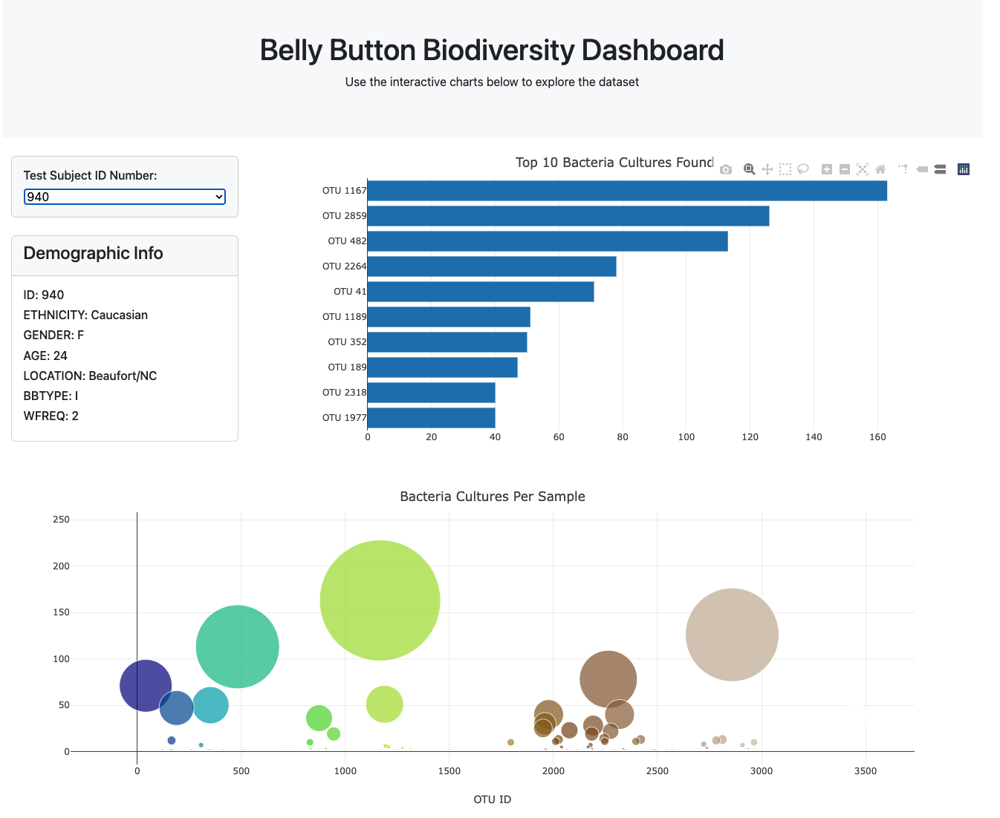
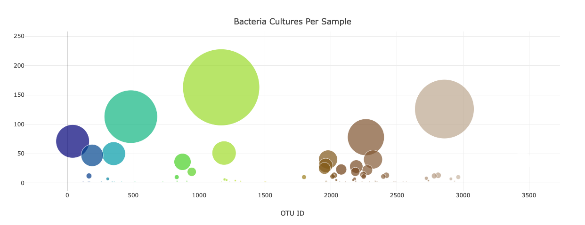
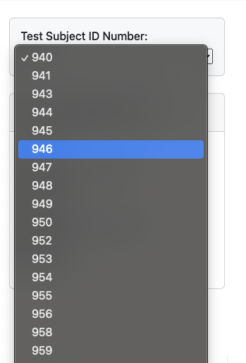

# Belly Button Biodiversity Dashboard

## Background

This project focuses on analyzing the Belly Button Biodiversity dataset. The dashboard visualizes the microbial species (operational taxonomic units, or OTUs) that colonize human navels. A small number of species are present in over 70% of people, while the rest are relatively rare. This interactive dashboard allows users to explore the dataset and visualize key metrics.

## Project Structure

### Files

- `index.html`: The main HTML file that structures the dashboard.
- `static/js/app.js`: JavaScript file that handles data fetching, processing, and visualization using D3.js and Plotly.js.
- `samples.json`: JSON file containing the dataset used in this analysis.
- `Images/Bacteria_Cultures_PerSample.jpeg`: Image showing the bubble chart visualization.
- `Images/General.jpeg`: Image showing the overall layout of the dashboard.
- `Images/Subject-ID.jpeg`: Image showing the dropdown menu for selecting Test Subject ID.

### Data Analysis

#### Dashboard Features

The dashboard provides the following features:
- **Test Subject ID Selection**: Users can select a test subject ID from a dropdown menu.
- **Demographic Information Panel**: Displays the selected individual's demographic information.
- **Bar Chart**: Shows the top 10 OTUs found in the selected individual.
- **Bubble Chart**: Displays all OTUs found in the selected individual, with bubble size representing sample values.

### Analysis Summary

1. **Top 10 Bacteria Cultures Found**:
   - The bar chart visualizes the top 10 most prevalent bacteria cultures for each individual.
   - Data includes OTU IDs, sample values, and OTU labels.

2. **Bacteria Cultures Per Sample**:
   - The bubble chart visualizes all bacteria cultures found in each individual.
   - Data includes OTU IDs, sample values, OTU labels, and the relative abundance of each OTU.

### Visualizations

1. **Overall Layout**
   - 

2. **Bacteria Cultures Per Sample**
   - 

3. **Test Subject ID Dropdown Menu**
   - 

## Sources

- [Belly Button Biodiversity Project](https://robdunnlab.com/projects/belly-button-biodiversity/)
- [D3.js Documentation](https://d3js.org/)
- [Plotly.js Documentation](https://plotly.com/javascript/)
- [Bootstrap Documentation](https://getbootstrap.com/)
- [GitHub Pages](https://pages.github.com/) for deployment.

## Deployment

This dashboard is deployed on GitHub Pages and can be accessed [https://github.com/endoplasmicosmic].

## Technologies Used

- **D3.js**: For data manipulation and handling.
- **Plotly.js**: For creating interactive charts.
- **HTML/CSS**: For structuring and styling the web page.
- **Bootstrap**: For responsive design.

## Acknowledgments

- Data source: [Belly Button Biodiversity Project](https://robdunnlab.com/projects/belly-button-biodiversity/)
- [Bootcamp Spot](https://bootcampspot.com) for providing the starter code and instructions.
